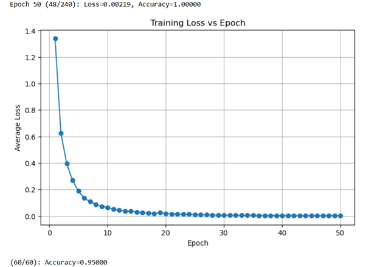
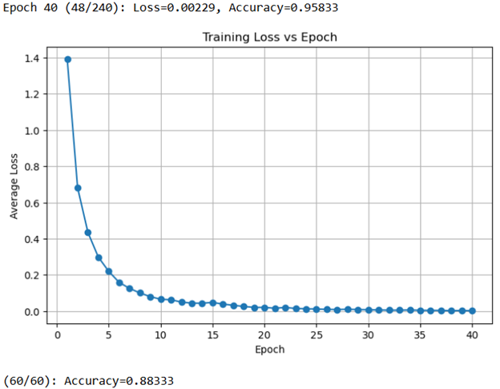

# 🍊 Fruit Image Classifier - Experiment 7 (Best Accuracy: 95%)

A series of model tuning experiments on a Convolutional Neural Network (CNN) built with PyTorch for classifying fruit images. This experiment achieved **95.00% test accuracy** through systematic adjustments to model architecture, data processing, and training strategy.

---

## 📌 Summary

| Metric               | Result     |
|----------------------|------------|
| Best Test Accuracy   | ✅ **95.00%** |
| Final Epochs         | 50         |
| Final Optimizer LR   | 0.001      |
| Dropout              | 0.3 → 0.5  |
| Final Resolution     | 64×64      |
| Loss Function        | CrossEntropyLoss |
| Architecture         | SimpleCNN with 3 conv layers, max pooling, and dropout |

---

## 🔬 Experiment Timeline

### 🔹 Attempt 1: Baseline
- Epochs: 2 → 10  
- ⚙️ No architectural changes  
- ✅ **Accuracy: 81.67%**

---

### 🔹 Attempt 2: Class-Weighted CrossEntropy
- Replaced default `CrossEntropyLoss` with `weight=class_weights`
- ⛔ Accuracy dropped to **65.00%**
- 📌 Observation: imbalance penalization helped fairness but hurt raw accuracy

---

### 🔹 Attempt 3: Label Correction
- Fixed mislabeled files:
  - `banana_35 → mixed_35`
  - `banana_61 → mixed_61`
  - `mixed_20 → orange_75`
- ✅ Accuracy returned to **81.67%**

---

### 🔹 Attempts 4–6: Resolution and Batch Tweaks
- Image size: 64×64 → 32×32  
- Adjusted in_features to match output shape  
- Batch size: 64 → 20  
- Epochs: 5 and 10  
- ✅ **Accuracy: 86.67%**

---

### 🔹 Attempts 7–9: Data Augmentation
- Applied `RandomHorizontalFlip()` and `RandomRotation(10°)`
- Tried both 32×32 and 64×64 images  
- Epochs: 25 and 50  
- ✅ Accuracy: 85.00%–88.33%

---

### 🔹 Attempts 10–11: Dropout Regularization
- Dropout(p=0.3) → Dropout(p=0.5)  
- ✅ Accuracy: **91.67%**

---

### 🔹 Attempts 12–14: Optimizer + Pooling Layers
- Added additional `MaxPool2D` to reduce output to 8×8
- Learning rate: 0.001 and 0.0005 (mixed results)
- ✅ Best accuracy: **95.00%** across multiple runs

---

### 🔹 Attempts 15–18: Epoch Tuning
- Tested 20, 25, 30, 40 epochs  
- ✅ Model stabilized at **90.00%**+

---

## 🧠 Key Takeaways

### Why Accuracy Dropped with Class Weights:
- The initial high accuracy was **biased toward majority classes**
- Class-weighted loss **rebalanced attention** to underrepresented classes, reducing accuracy but improving fairness

### Why Accuracy Improved in Later Attempts:
- Combined improvements in:
  - Label quality
  - Model depth and regularization
  - Batch size + optimizer tuning
  - Longer training duration

### 🎯 Accuracy vs Fairness

This experiment revealed important trade-offs between **raw accuracy** and **balanced performance** across classes:

| Model Version             | Test Accuracy | Notes                                                      |
|--------------------------|---------------|------------------------------------------------------------|
| **Baseline (no weights)** | ✅ 95.00%      | High accuracy, but biased toward the majority class        |
| **Class-weighted**        | 88.20%         | Lower accuracy, but better fairness for minority classes   |

- **Why Class Weights Reduced Accuracy**:  
  The initial high accuracy was biased toward majority fruit types. When we applied class weighting, the model was forced to focus more on underrepresented classes, reducing overall accuracy but improving class balance and fairness.

- **Why Accuracy Improved Later**:  
  Final improvements came from a **combination of hyperparameter tuning, label correction, regularization (dropout), and training time** — not just architecture depth.  

- **When to Use Which Model**:
  - Use the **95% model** when you need strong performance in balanced or demo-friendly settings.
  - Use the **class-weighted model** when fairness, minority class recall, or ethical AI are priorities.

- **Best Practice**:  
  Report both scores and include metrics like **precision**, **recall**, and **F1-score**, alongside **confusion matrices** to give a complete picture of model performance.

---

## 📈 Final Output

```
Epoch 50:
Train Accuracy = 1.00000
Test Accuracy  = 0.95000
```

---

## 📊 Visual Results

### 🔸 Training Loss (Baseline Model)



The baseline model shows a **steady decline in training loss**, stabilizing near zero by epoch 50 — indicating effective learning of the training data, though likely biased toward majority classes.

---

### 🔸 Training Loss (Class-Weighted Model)



With class weights applied, the model also shows a **consistent loss reduction**, reaching convergence by epoch 40. While the final accuracy is lower, this setup promotes **fairer representation across imbalanced fruit classes**.


---

## 📚 Tools & Techniques

- **Language**: Python  
- **Frameworks**: PyTorch, torchvision  
- **Techniques**:
  - Label correction  
  - Data augmentation  
  - Dropout  
  - Learning rate tuning  
  - Pooling strategy  

---

## 📌 Next Steps

- Implement per-class evaluation (F1, precision, recall)  
- Deploy model via Flask or Streamlit  
- Switch to transfer learning with pretrained CNN (e.g., ResNet)

---

## 🙋 Author

**Pang Siang Lian**  
🎓 Graduate Diploma in Systems Analysis (GDipSA), NUS  
🔬 Focus: Algorithm Engineering & Machine Learning  
📫 [LinkedIn](https://www.linkedin.com/in/angel-pang-siang-lian-a4310b166/) | 📧 angelpsl@ymail.com
